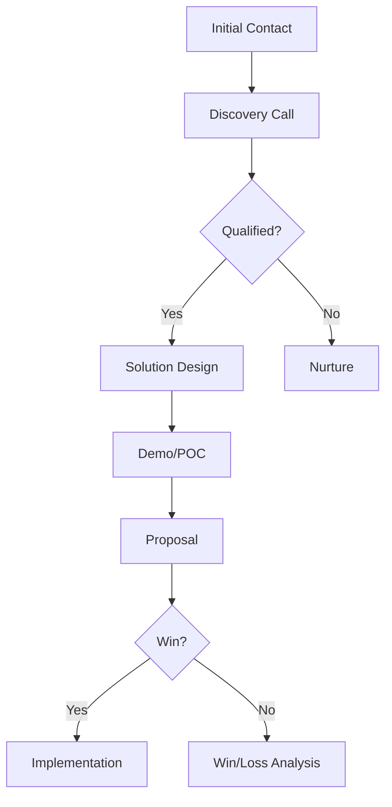

# Presales Playbook - Architecture & Design

## Overview

The Presales Playbook is a comprehensive, GitBook-style guide designed for GitHub Pages publication. It serves as a structured handbook combining presales methodology, best practices, and curated resources from the existing [`presales/`](../presales) repository.

## Design Philosophy

**Hybrid Approach:**
- **New Content**: Methodology, frameworks, and playbook-style guidance
- **Curated Links**: References to existing presales/ resources (case studies, templates, demos)
- **GitHub Pages Ready**: Static site generation with clean navigation
- **Progressive Learning**: Structured chapters from fundamentals to advanced topics

## Repository Structure

```
presales-playbook/
├── README.md                           # Landing page & introduction
├── ARCHITECTURE.md                     # This file
├── CONTRIBUTING.md                     # Contribution guidelines
│
├── docs/                               # Main content directory
│   ├── _sidebar.md                     # Navigation sidebar config
│   ├── index.md                        # Documentation home
│   │
│   ├── 01-foundations/                 # Chapter 1: Foundations
│   │   ├── README.md                   # Chapter overview
│   │   ├── what-is-presales.md         # Role definition
│   │   ├── presales-vs-sales.md        # Key differences
│   │   ├── skills-matrix.md            # Required skills
│   │   └── career-path.md              # Growth trajectory
│   │
│   ├── 02-methodology/                 # Chapter 2: Presales Process
│   │   ├── README.md                   # Chapter overview
│   │   ├── discovery.md                # Discovery phase
│   │   ├── qualification.md            # Opportunity qualification
│   │   ├── solution-design.md          # Solution development
│   │   ├── demonstration.md            # Demo delivery
│   │   ├── proof-of-concept.md         # POC execution
│   │   └── proposal.md                 # Proposal creation
│   │
│   ├── 03-discovery/                   # Chapter 3: Discovery Framework
│   │   ├── README.md                   # Chapter overview
│   │   ├── preparation.md              # Pre-call preparation
│   │   ├── questioning-techniques.md   # SPIN, MEDDIC, BANT
│   │   ├── stakeholder-mapping.md      # Identifying decision makers
│   │   ├── pain-point-analysis.md      # Problem identification
│   │   └── requirements-gathering.md   # Technical requirements
│   │
│   ├── 04-solution-design/             # Chapter 4: Solution Architecture
│   │   ├── README.md                   # Chapter overview
│   │   ├── design-principles.md        # Architecture principles
│   │   ├── reference-architectures.md  # Common patterns (links to presales/)
│   │   ├── technical-documentation.md  # Documentation best practices
│   │   ├── diagramming.md              # Creating effective diagrams
│   │   └── case-studies.md             # Real-world examples (links to presales/)
│   │
│   ├── 05-demonstration/               # Chapter 5: Demo Excellence
│   │   ├── README.md                   # Chapter overview
│   │   ├── demo-strategy.md            # Planning effective demos
│   │   ├── storytelling.md             # Narrative techniques
│   │   ├── handling-objections.md      # Overcoming resistance
│   │   ├── technical-demos.md          # Technical demo delivery
│   │   └── demo-environments.md        # Environment management
│   │
│   ├── 06-proof-of-concept/            # Chapter 6: POC Management
│   │   ├── README.md                   # Chapter overview
│   │   ├── poc-planning.md             # Scoping and planning
│   │   ├── success-criteria.md         # Defining success metrics
│   │   ├── execution.md                # POC execution
│   │   ├── evaluation.md               # Results assessment
│   │   └── demo-projects.md            # Example POCs (links to presales/)
│   │
│   ├── 07-proposals/                   # Chapter 7: Winning Proposals
│   │   ├── README.md                   # Chapter overview
│   │   ├── rfp-response.md             # RFP strategy
│   │   ├── proposal-structure.md       # Document structure
│   │   ├── technical-writing.md        # Writing best practices
│   │   ├── pricing-strategy.md         # Pricing considerations
│   │   └── templates.md                # Proposal templates (links to presales/)
│   │
│   ├── 08-technical-skills/            # Chapter 8: Technical Competencies
│   │   ├── README.md                   # Chapter overview
│   │   ├── cloud-platforms.md          # AWS, Azure, GCP
│   │   ├── integration-patterns.md     # API, microservices
│   │   ├── data-analytics.md           # Analytics solutions
│   │   ├── ai-ml.md                    # AI/ML solutions
│   │   └── security.md                 # Security considerations
│   │
│   ├── 09-soft-skills/                 # Chapter 9: Communication & Collaboration
│   │   ├── README.md                   # Chapter overview
│   │   ├── stakeholder-management.md   # Managing relationships
│   │   ├── presentation-skills.md      # Effective presenting
│   │   ├── negotiation.md              # Negotiation techniques
│   │   ├── cross-functional.md         # Working with teams
│   │   └── customer-empathy.md         # Understanding customers
│   │
│   ├── 10-tools-resources/             # Chapter 10: Tools & Templates
│   │   ├── README.md                   # Chapter overview
│   │   ├── presales-stack.md           # Essential tools
│   │   ├── crm-systems.md              # CRM best practices
│   │   ├── demo-environments.md        # Demo infrastructure
│   │   ├── templates-library.md        # Template collection (links to presales/)
│   │   └── automation.md               # Automation opportunities
│   │
│   ├── 11-metrics-measurement/         # Chapter 11: Success Metrics
│   │   ├── README.md                   # Chapter overview
│   │   ├── kpis.md                     # Key performance indicators
│   │   ├── roi-analysis.md             # ROI calculation
│   │   ├── win-loss.md                 # Win/loss analysis
│   │   └── continuous-improvement.md   # Improvement practices
│   │
│   └── 12-advanced-topics/             # Chapter 12: Advanced Strategies
│       ├── README.md                   # Chapter overview
│       ├── enterprise-sales.md         # Enterprise strategies
│       ├── multi-threading.md          # Multiple stakeholders
│       ├── competitive-positioning.md  # Competitive strategy
│       ├── value-selling.md            # Value-based selling
│       └── scaling-presales.md         # Scaling teams
│
├── .github/                            # GitHub configuration
│   └── workflows/
│       ├── deploy-pages.yml            # GitHub Pages deployment
│       └── validate-links.yml          # Link validation
│
├── assets/                             # Static assets
│   ├── images/                         # Images and diagrams
│   ├── css/                            # Custom styling
│   └── js/                             # JavaScript enhancements
│
└── _config.yml                         # GitHub Pages config (Jekyll)
```

## Content Strategy

### Chapter Organization

Each chapter follows this structure:

1. **README.md**: Chapter overview, learning objectives, key takeaways
2. **Topic Files**: Individual markdown files for each topic
3. **Cross-References**: Links to related chapters and external resources
4. **Practical Examples**: Real-world scenarios and case studies
5. **Resource Links**: Curated links to presales/ content

### Content Types

#### 1. Methodology Content (New)
- Frameworks and processes
- Best practices and guidelines
- Checklists and worksheets
- Step-by-step guides

#### 2. Reference Content (New)
- Definitions and terminology
- Comparison matrices
- Decision trees
- Quick reference guides

#### 3. Curated Links (To presales/)
- Case studies → `../presales/case-studies/`
- Templates → `../presales/templates/`
- Demo projects → `../presales/demo-projects/`
- Interactive demos → `../presales/interactive-demos/`

### Writing Style

- **Conversational yet professional**
- **Action-oriented** (how-to focus)
- **Practical examples** throughout
- **Visuals and diagrams** where helpful
- **Consistent formatting** across chapters

## GitHub Pages Implementation

### Technology Stack

**Static Site Generator:** Jekyll (GitHub Pages native)
- Markdown-based content
- Liquid templating
- Automatic deployment
- Custom themes supported

**Alternative Option:** Docsify (GitBook-like)
- No build step required
- Pure JavaScript rendering
- GitBook-style navigation
- Easy customization

**Recommended:** Docsify for GitBook experience

### Docsify Configuration

```html
<!-- index.html -->
<!DOCTYPE html>
<html>
<head>
  <meta charset="UTF-8">
  <title>Presales Playbook</title>
  <meta name="description" content="Comprehensive guide for presales professionals">
  <meta name="viewport" content="width=device-width, initial-scale=1.0">
  <link rel="stylesheet" href="//cdn.jsdelivr.net/npm/docsify@4/lib/themes/vue.css">
</head>
<body>
  <div id="app"></div>
  <script>
    window.$docsify = {
      name: 'Presales Playbook',
      repo: 'gauravs19/presales-playbook',
      loadSidebar: true,
      subMaxLevel: 3,
      search: 'auto',
      pagination: {
        previousText: '← Previous',
        nextText: 'Next →'
      }
    }
  </script>
  <script src="//cdn.jsdelivr.net/npm/docsify@4"></script>
  <script src="//cdn.jsdelivr.net/npm/docsify/lib/plugins/search.min.js"></script>
</body>
</html>
```

### Navigation Structure

**_sidebar.md** for Docsify:
```markdown
* [Home](/)

* **1. Foundations**
  * [What is Presales?](docs/01-foundations/what-is-presales.md)
  * [Presales vs Sales](docs/01-foundations/presales-vs-sales.md)
  * [Skills Matrix](docs/01-foundations/skills-matrix.md)
  * [Career Path](docs/01-foundations/career-path.md)

* **2. Methodology**
  * [Discovery Phase](docs/02-methodology/discovery.md)
  * [Qualification](docs/02-methodology/qualification.md)
  * [Solution Design](docs/02-methodology/solution-design.md)
  * [Demonstration](docs/02-methodology/demonstration.md)
  * [Proof of Concept](docs/02-methodology/proof-of-concept.md)
  * [Proposal](docs/02-methodology/proposal.md)

[... continues for all chapters ...]
```

## Integration with Existing Presales Resources

### Linking Strategy

**Relative Links:**
```markdown
For detailed case studies, see our [Cloud Migration Case Study](../presales/case-studies/cloud-migration/README.md).

Browse all available [presales templates](../presales/templates/).

Explore our [interactive demos](../presales/interactive-demos/).
```

**Resource Sections:**
Each chapter includes a "Resources" section at the bottom:
```markdown
## 📚 Related Resources

### From Presales Repository
- [Solution Design Template](../presales/templates/solution-design/)
- [Cloud Migration Case Study](../presales/case-studies/cloud-migration/)
- [API Integration Demo](../presales/demo-projects/api-integration/)

### External Resources
- [MEDDIC Sales Methodology](https://example.com)
- [Solution Architecture Patterns](https://example.com)
```

### Cross-Repository Benefits

1. **Playbook** = Methodology and guidance
2. **Presales/** = Practical implementations and examples
3. Together = Complete presales ecosystem

## Visual Design

### Theme & Styling

**Color Palette:**
- Primary: Professional blue (#0066CC)
- Secondary: Dark gray (#2C3E50)
- Accent: Green (#27AE60) for success
- Warning: Amber (#F39C12)

**Typography:**
- Headings: System font stack (readable)
- Body: Georgia or similar (professional)
- Code: Monospace (JetBrains Mono or Fira Code)

**Components:**
- Callout boxes (Tips, Warnings, Best Practices)
- Code blocks with syntax highlighting
- Responsive tables
- Image galleries
- Mermaid diagrams

### Diagram Strategy

Use Mermaid for:
- Process flows
- Decision trees
- Org charts
- Sequence diagrams

Example:


## Content Development Workflow

### Phase 1: Foundation (Weeks 1-2)
- Set up repository structure
- Configure GitHub Pages
- Create navigation framework
- Write Chapter 1: Foundations

### Phase 2: Core Methodology (Weeks 3-5)
- Chapter 2: Methodology
- Chapter 3: Discovery
- Chapter 4: Solution Design
- Integrate links to presales/ resources

### Phase 3: Execution (Weeks 6-8)
- Chapter 5: Demonstration
- Chapter 6: POC Management
- Chapter 7: Proposals
- Add practical examples

### Phase 4: Skills & Tools (Weeks 9-10)
- Chapter 8: Technical Skills
- Chapter 9: Soft Skills
- Chapter 10: Tools & Resources

### Phase 5: Advanced & Polish (Weeks 11-12)
- Chapter 11: Metrics
- Chapter 12: Advanced Topics
- Final review and editing
- Launch preparation

## Deployment Strategy

### GitHub Pages Setup

1. **Repository Settings:**
   - Enable GitHub Pages
   - Source: `main` branch, `/` root or `/docs` folder
   - Custom domain (optional)

2. **Automated Deployment:**
   - Push to `main` triggers automatic deployment
   - GitHub Actions for validation
   - Link checking before deployment

3. **Custom Domain (Optional):**
   ```
   playbook.yourpresalesdomain.com
   ```

### CI/CD Workflow

```yaml
name: Deploy to GitHub Pages

on:
  push:
    branches: [main]

jobs:
  deploy:
    runs-on: ubuntu-latest
    steps:
      - uses: actions/checkout@v3
      - name: Validate Markdown
        run: |
          npm install -g markdownlint-cli
          markdownlint '**/*.md'
      - name: Check Links
        run: |
          npm install -g markdown-link-check
          find . -name \*.md -exec markdown-link-check {} \;
      - name: Deploy to GitHub Pages
        uses: peaceiris/actions-gh-pages@v3
        with:
          github_token: ${{ secrets.GITHUB_TOKEN }}
          publish_dir: ./
```

## Success Metrics

### Qualitative
- ✅ Clear, navigable structure
- ✅ Comprehensive coverage of presales topics
- ✅ Professional design and presentation
- ✅ Valuable, actionable content
- ✅ Strong integration with presales/ resources

### Quantitative
- 📊 12 complete chapters
- 📊 50+ individual topic pages
- 📊 100+ links to presales/ resources
- 📊 20+ diagrams and visuals
- 📊 Mobile-responsive design

## Maintenance Plan

### Regular Updates
- **Monthly:** Review and update content
- **Quarterly:** Add new chapters/topics
- **Annually:** Comprehensive content audit

### Community Contributions
- Accept pull requests for improvements
- Issue templates for suggestions
- Contributor recognition

## Next Steps

1. ✅ Finalize directory structure
2. ⬜ Set up GitHub Pages with Docsify
3. ⬜ Create navigation sidebar
4. ⬜ Write Chapter 1: Foundations
5. ⬜ Establish content templates
6. ⬜ Begin systematic chapter development

---

**This architecture provides a clear roadmap for building a comprehensive, professional presales playbook that serves as both a learning resource and a reference guide while leveraging existing presales repository content.**
