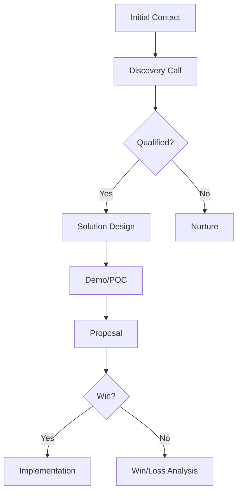

# Presales Playbook - Architecture & Design

## Overview

The Presales Playbook is a comprehensive, GitBook-style guide designed for GitHub Pages publication. It serves as a structured handbook combining presales methodology, best practices, and curated resources from the existing [`presales/`](../presales) repository.

## Design Philosophy

**Hybrid Approach:**
- **New Content**: Methodology, frameworks, and playbook-style guidance
- **Curated Links**: References to existing presales/ resources (case studies, templates, demos)
- **GitHub Pages Ready**: Static site generation with clean navigation
- **Progressive Learning**: Structured chapters from fundamentals to advanced topics

## Repository Structure

The playbook uses a **two-level structure**: each section folder contains one markdown
file per subsection (e.g. `3.2 Questioning Techniques` is a single file whose topics
are `##` headings). Deep links use Docsify anchors (`file.md?id=...`). Old three-level
page URLs are redirected via `redirects.js` (Docsify `alias` config).

```
presales-playbook/
├── index.html                          # Docsify shell + config
├── README.md                           # Landing page & introduction
├── _sidebar.md                         # Navigation (2 levels: section → subsection)
├── redirects.js                        # Old page routes → merged pages (alias map)
├── ARCHITECTURE.md                     # This file
├── CONTRIBUTING.md                     # Contribution guidelines
│
├── docs/
│   ├── 00-start-here/                  # 0. Start Here (incl. graduation checkpoint)
│   ├── 01-foundations/                 # 1. Foundations
│   ├── 02-deal-orchestration/          # 2. Deal Orchestration
│   ├── 03-discovery/                   # 3. Discovery Framework
│   ├── 04-solution-design/             # 4. Solution Design
│   ├── 05-demo-excellence/             # 5. Demo Excellence
│   ├── 06-poc/                         # 6. POC Execution & Management
│   ├── 07-commercial-influence/        # 7. Commercial Influence
│   ├── 08-technical-depth/             # 8. Technical Depth
│   ├── 09-executive-selling/           # 9. Executive Selling & Soft Skills
│   ├── 10-tools/                       # 10. Tools & Infrastructure
│   ├── 11-metrics/                     # 11. Metrics & Continuous Improvement
│   ├── 12-scaling/                     # 12. Scaling Presales Teams
│   └── 13-templates/                   # 13. Templates & Artifacts (one file per template)
│
├── assets/                             # Static assets (css, js)
└── .github/                            # Issue templates, workflows
```

Each subsection file follows this shape:

```markdown
# 3.2 Questioning Techniques

## 3.2.1 The Layered Diagnostic — D.A.R.T. Framework
...

## 3.2.2 Peeling the Pain Onion
...
```

## Content Strategy

### Chapter Organization

Each chapter follows this structure:

1. **README.md**: Chapter overview, learning objectives, key takeaways
2. **Topic Files**: Individual markdown files for each topic
3. **Cross-References**: Links to related chapters and external resources
4. **Practical Examples**: Real-world scenarios and case studies
5. **Resource Links**: Curated links to presales/ content

### Content Types

#### 1. Methodology Content (New)
- Frameworks and processes
- Best practices and guidelines
- Checklists and worksheets
- Step-by-step guides

#### 2. Reference Content (New)
- Definitions and terminology
- Comparison matrices
- Decision trees
- Quick reference guides

#### 3. Curated Links (To presales/)
- Case studies → `../presales/case-studies/`
- Templates → `../presales/templates/`
- Demo projects → `../presales/demo-projects/`
- Interactive demos → `../presales/interactive-demos/`

### Writing Style

- **Conversational yet professional**
- **Action-oriented** (how-to focus)
- **Practical examples** throughout
- **Visuals and diagrams** where helpful
- **Consistent formatting** across chapters

## GitHub Pages Implementation

### Technology Stack

**Static Site Generator:** Jekyll (GitHub Pages native)
- Markdown-based content
- Liquid templating
- Automatic deployment
- Custom themes supported

**Alternative Option:** Docsify (GitBook-like)
- No build step required
- Pure JavaScript rendering
- GitBook-style navigation
- Easy customization

**Recommended:** Docsify for GitBook experience

### Docsify Configuration

```html
<!-- index.html -->
<!DOCTYPE html>
<html>
<head>
  <meta charset="UTF-8">
  <title>Presales Playbook</title>
  <meta name="description" content="Comprehensive guide for presales professionals">
  <meta name="viewport" content="width=device-width, initial-scale=1.0">
  <link rel="stylesheet" href="//cdn.jsdelivr.net/npm/docsify@4/lib/themes/vue.css">
</head>
<body>
  <div id="app"></div>
  <script>
    window.$docsify = {
      name: 'Presales Playbook',
      repo: 'gauravs19/presales-playbook',
      loadSidebar: true,
      subMaxLevel: 3,
      search: 'auto',
      pagination: {
        previousText: '← Previous',
        nextText: 'Next →'
      }
    }
  </script>
  <script src="//cdn.jsdelivr.net/npm/docsify@4"></script>
  <script src="//cdn.jsdelivr.net/npm/docsify/lib/plugins/search.min.js"></script>
</body>
</html>
```

### Navigation Structure

**_sidebar.md** for Docsify (2 levels — sections and subsections only; the current
page's topics appear as expandable H2 entries via `subMaxLevel: 2`):
```markdown
* [Home](/)

* **3. Discovery Framework**
  * [3.1 Preparation & Hypothesis-Led Entry](docs/03-discovery/preparation-hypothesis-led-entry.md)
  * [3.2 Questioning Techniques](docs/03-discovery/questioning-techniques.md)
  * [3.3 Technical Discovery](docs/03-discovery/technical-discovery.md)
  * [3.4 Stakeholder Mapping](docs/03-discovery/stakeholder-mapping.md)
  * [3.5 Pain Quantification](docs/03-discovery/pain-quantification.md)
  * [3.6 Discovery Output & Handoff](docs/03-discovery/discovery-output-handoff.md)

[... continues for all sections ...]
```

## Integration with Existing Presales Resources

### Linking Strategy

**Relative Links:**
```markdown
For detailed case studies, see our [Cloud Migration Case Study](../presales/case-studies/cloud-migration/README.md).

Browse all available [presales templates](../presales/templates/).

Explore our [interactive demos](../presales/interactive-demos/).
```

**Resource Sections:**
Each chapter includes a "Resources" section at the bottom:
```markdown
## 📚 Related Resources

### From Presales Repository
- [Solution Design Template](../presales/templates/solution-design/)
- [Cloud Migration Case Study](../presales/case-studies/cloud-migration/)
- [API Integration Demo](../presales/demo-projects/api-integration/)

### External Resources
- [MEDDIC Sales Methodology](https://example.com)
- [Solution Architecture Patterns](https://example.com)
```

### Cross-Repository Benefits

1. **Playbook** = Methodology and guidance
2. **Presales/** = Practical implementations and examples
3. Together = Complete presales ecosystem

## Visual Design

### Theme & Styling

**Color Palette:**
- Primary: Professional blue (#0066CC)
- Secondary: Dark gray (#2C3E50)
- Accent: Green (#27AE60) for success
- Warning: Amber (#F39C12)

**Typography:**
- Headings: System font stack (readable)
- Body: Georgia or similar (professional)
- Code: Monospace (JetBrains Mono or Fira Code)

**Components:**
- Callout boxes (Tips, Warnings, Best Practices)
- Code blocks with syntax highlighting
- Responsive tables
- Image galleries
- Mermaid diagrams

### Diagram Strategy

Use Mermaid for:
- Process flows
- Decision trees
- Org charts
- Sequence diagrams

Example:

```mermaid
graph TD
    A[Initial Contact] --> B[Discovery Call]
    B --> C{Qualified?}
    C -->|Yes| D[Solution Design]
    C -->|No| E[Nurture]
    D --> F[Demo/POC]
    F --> G[Proposal]
    G --> H{Win?}
    H -->|Yes| I[Implementation]
    H -->|No| J[Win/Loss Analysis]
```

## Content Development Workflow

### Phase 1: Foundation (Weeks 1-2)
- Set up repository structure
- Configure GitHub Pages
- Create navigation framework
- Write Chapter 1: Foundations

### Phase 2: Core Methodology (Weeks 3-5)
- Chapter 2: Methodology
- Chapter 3: Discovery
- Chapter 4: Solution Design
- Integrate links to presales/ resources

### Phase 3: Execution (Weeks 6-8)
- Chapter 5: Demonstration
- Chapter 6: POC Management
- Chapter 7: Proposals
- Add practical examples

### Phase 4: Skills & Tools (Weeks 9-10)
- Chapter 8: Technical Skills
- Chapter 9: Soft Skills
- Chapter 10: Tools & Resources

### Phase 5: Advanced & Polish (Weeks 11-12)
- Chapter 11: Metrics
- Chapter 12: Advanced Topics
- Final review and editing
- Launch preparation

## Deployment Strategy

### GitHub Pages Setup

1. **Repository Settings:**
   - Enable GitHub Pages
   - Source: `main` branch, `/` root or `/docs` folder
   - Custom domain (optional)

2. **Automated Deployment:**
   - Push to `main` triggers automatic deployment
   - GitHub Actions for validation
   - Link checking before deployment

3. **Custom Domain (Optional):**
   ```
   playbook.yourpresalesdomain.com
   ```

### CI/CD Workflow

```yaml
name: Deploy to GitHub Pages

on:
  push:
    branches: [main]

jobs:
  deploy:
    runs-on: ubuntu-latest
    steps:
      - uses: actions/checkout@v3
      - name: Validate Markdown
        run: |
          npm install -g markdownlint-cli
          markdownlint '**/*.md'
      - name: Check Links
        run: |
          npm install -g markdown-link-check
          find . -name \*.md -exec markdown-link-check {} \;
      - name: Deploy to GitHub Pages
        uses: peaceiris/actions-gh-pages@v3
        with:
          github_token: ${{ secrets.GITHUB_TOKEN }}
          publish_dir: ./
```

## Success Metrics

### Qualitative
- ✅ Clear, navigable structure
- ✅ Comprehensive coverage of presales topics
- ✅ Professional design and presentation
- ✅ Valuable, actionable content
- ✅ Strong integration with presales/ resources

### Quantitative
- 📊 12 complete chapters
- 📊 50+ individual topic pages
- 📊 100+ links to presales/ resources
- 📊 20+ diagrams and visuals
- 📊 Mobile-responsive design

## Maintenance Plan

### Regular Updates
- **Monthly:** Review and update content
- **Quarterly:** Add new chapters/topics
- **Annually:** Comprehensive content audit

### Community Contributions
- Accept pull requests for improvements
- Issue templates for suggestions
- Contributor recognition

## Next Steps

1. ✅ Finalize directory structure
2. ⬜ Set up GitHub Pages with Docsify
3. ⬜ Create navigation sidebar
4. ⬜ Write Chapter 1: Foundations
5. ⬜ Establish content templates
6. ⬜ Begin systematic chapter development

---

**This architecture provides a clear roadmap for building a comprehensive, professional presales playbook that serves as both a learning resource and a reference guide while leveraging existing presales repository content.**
