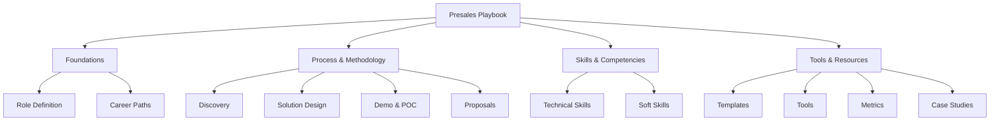

# Presales Playbook

> **Your comprehensive guide to presales excellence** — From discovery to close, master the art and science of technical presales.

[](https://gauravs19.github.io/presales-playbook/)
[](LICENSE.md)
[](CONTRIBUTING.md)

---

## 🎯 What is This?

The **Presales Playbook** is an open-source, comprehensive guide for presales professionals at all levels. Whether you're new to presales or a seasoned solutions architect, this playbook provides:

- **📚 Structured Methodology**: Step-by-step frameworks for the entire presales lifecycle
- **🛠️ Practical Tools**: Templates, checklists, and frameworks you can use immediately
- **💡 Best Practices**: Industry-proven techniques from successful presales engagements
- **🔗 Real Examples**: Links to case studies, demos, and real-world implementations
- **📈 Career Growth**: Guidance for advancing your presales career

## 🚀 Quick Start

### Browse Online

Visit the **[Presales Playbook](https://gauravs19.github.io/presales-playbook/)**

### Navigate by Chapter

1. **[Foundations](docs/01-foundations/README.md)** - Understanding the presales role
2. **[Methodology](docs/02-methodology/README.md)** - The presales process from start to finish
3. **[Discovery](docs/03-discovery/README.md)** - Mastering customer discovery
4. **[Solution Design](docs/04-solution-design/README.md)** - Architecting winning solutions
5. **[Demonstration](docs/05-demonstration/README.md)** - Delivering compelling demos
6. **[POC Management](docs/06-proof-of-concept/README.md)** - Running successful proof-of-concepts
7. **[Proposals](docs/07-proposals/README.md)** - Writing winning proposals
8. **[Technical Skills](docs/08-technical-skills/README.md)** - Essential technical competencies
9. **[Soft Skills](docs/09-soft-skills/README.md)** - Communication and collaboration
10. **[Tools & Resources](docs/10-tools-resources/README.md)** - Presales tech stack
11. **[Metrics](docs/11-metrics-measurement/README.md)** - Measuring presales success
12. **[Advanced Topics](docs/12-advanced-topics/README.md)** - Enterprise and strategic presales

## 📖 What You'll Learn

### For Beginners
- What presales is and how it differs from sales
- Essential skills and knowledge areas
- How to conduct effective discovery calls
- Creating your first solution designs
- Demo preparation and delivery basics

### For Intermediate Practitioners
- Advanced questioning and discovery techniques
- Solution architecture patterns and best practices
- Managing complex proof-of-concepts
- Writing compelling technical proposals
- Stakeholder management strategies

### For Advanced Professionals
- Enterprise presales strategies
- Multi-threading complex deals
- Competitive positioning and differentiation
- Building and scaling presales teams
- Value-based selling approaches

## 🎓 Learning Paths

Choose your path based on your role and goals:

### 🔰 **New to Presales**
Start here → [What is Presales?](docs/01-foundations/what-is-presales.md)

**Recommended sequence:**
1. Foundations (Chapter 1)
2. Presales Methodology (Chapter 2)
3. Discovery Framework (Chapter 3)
4. Soft Skills (Chapter 9)

### 🔧 **Solutions Engineer/Consultant**
Focus here → [Solution Architecture](docs/04-solution-design/README.md)

**Recommended sequence:**
1. Solution Design (Chapter 4)
2. Technical Skills (Chapter 8)
3. POC Management (Chapter 6)
4. Demo Excellence (Chapter 5)

### 📊 **Presales Manager/Leader**
Focus here → [Advanced Topics](docs/12-advanced-topics/README.md)

**Recommended sequence:**
1. Metrics & Measurement (Chapter 11)
2. Advanced Strategies (Chapter 12)
3. Tools & Resources (Chapter 10)
4. Methodology Review (Chapter 2)

## 🔗 Related Resources

This playbook is part of a larger presales ecosystem:

- **[Presales Portfolio](../presales/)** - Case studies, demos, and templates
  - [Cloud Migration Case Study](../presales/case-studies/cloud-migration/README.md)
  - [AI Implementation Case Study](../presales/case-studies/ai-implementation/README.md)
  - [Demo Projects](../presales/demo-projects/)
  - [Templates Library](../presales/templates/)

## 🌟 Key Features

### ✅ Comprehensive Coverage
- 12 chapters covering all aspects of presales
- 50+ individual topic pages
- 100+ links to external resources and examples

### ✅ Practical & Actionable
- Real-world frameworks and methodologies
- Downloadable templates and checklists
- Step-by-step guides and workflows

### ✅ Continuously Updated
- Regular content updates
- Community contributions welcome
- Industry best practices incorporated

### ✅ Open Source
- Free to use and share
- Contribute your expertise
- Built by the presales community

## 📊 Content Map



## 🤝 Contributing

We welcome contributions from the presales community! Here's how you can help:

- **💡 Share Knowledge**: Add new content or improve existing pages
- **🐛 Fix Issues**: Report bugs or broken links
- **📝 Improve Documentation**: Enhance clarity and examples
- **🌍 Translate**: Help make this resource available in other languages

See our [Contributing Guide](CONTRIBUTING.md) for details.

## 🏗️ Project Structure

```
presales-playbook/
├── README.md              # This file
├── ARCHITECTURE.md        # Technical architecture
├── CONTRIBUTING.md        # Contribution guidelines
├── _sidebar.md           # Navigation structure
├── index.html            # Docsify configuration
│
└── docs/                 # All content chapters
    ├── 01-foundations/
    ├── 02-methodology/
    ├── 03-discovery/
    ├── 04-solution-design/
    ├── 05-demonstration/
    ├── 06-proof-of-concept/
    ├── 07-proposals/
    ├── 08-technical-skills/
    ├── 09-soft-skills/
    ├── 10-tools-resources/
    ├── 11-metrics-measurement/
    ├── 12-advanced-topics/
    └── appendix/
```

## 🛠️ Built With

- **[Docsify](https://docsify.js.org/)** - Documentation site generator
- **[Mermaid](https://mermaid-js.github.io/)** - Diagrams and flowcharts
- **[GitHub Pages](https://pages.github.com/)** - Free hosting
- **Markdown** - Simple, readable content format

## 📜 License

This project is licensed under the MIT License - see the [LICENSE.md](LICENSE.md) file for details.

## 📧 Contact & Support

- **Issues**: Report bugs or request features via [GitHub Issues](https://github.com/gauravs19/ag-wks/issues)
- **Discussions**: Join conversations in [GitHub Discussions](https://github.com/gauravs19/ag-wks/discussions)
- **LinkedIn**: Connect and share feedback

## 🙏 Acknowledgments

This playbook draws from:
- Years of real-world presales experience
- Industry best practices and frameworks
- Contributions from the presales community
- Insights from successful engagements across multiple industries

---

## 🚦 Getting Started

Ready to dive in? Here's your roadmap:

1. **📖 Read** - Start with [What is Presales?](docs/01-foundations/what-is-presales.md)
2. **🎯 Focus** - Choose your learning path above
3. **🛠️ Practice** - Apply frameworks to your work
4. **📈 Measure** - Track your improvement
5. **🤝 Contribute** - Share your learnings

**[Start Learning →](docs/01-foundations/what-is-presales.md)**

---

<div align="center">

**Made with ❤️ for presales professionals worldwide**

⭐ Star this repo if you find it helpful! ⭐

</div>
